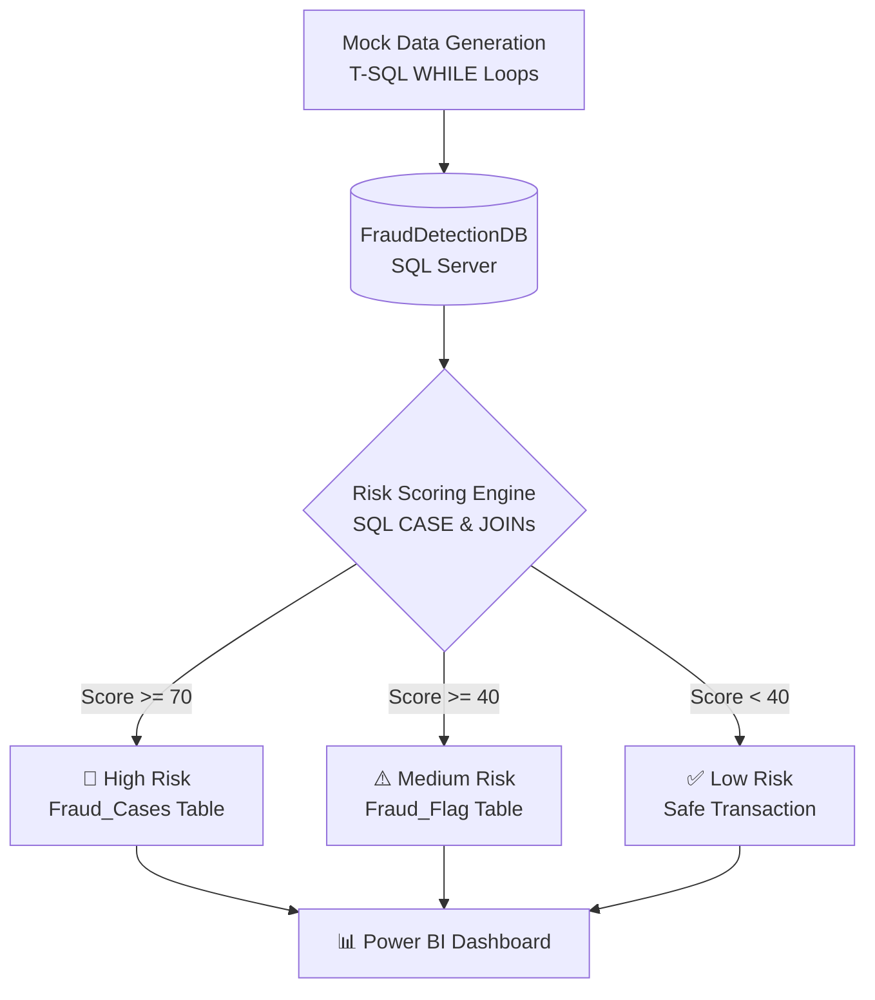

  
# 🚨 Credit Card Fraud Detection & Analytics
**An End-to-End SQL & Power BI Solution**

---

## 💡 About The Project

Financial institutions lose billions to credit card fraud every year. This project tackles the problem by building a **robust, custom database** and utilizing **data analytics** to identify suspicious transaction patterns.

Instead of relying on pre-existing static CSV datasets, this project **simulates a real-world banking environment**:
- 🏦 **Custom-built SQL Architecture** with 7 normalized tables.
- ⚙️ **Automated Data Generation** using advanced T-SQL for 100,000+ realistic transactions.
- 🧠 **Dynamic Risk Scoring Algorithm** considering velocity, location, transaction amount, and merchant history.
- 📊 **Interactive Power BI Dashboard** to visualize fraud hotspots and high-risk behaviors.

---

## 🏗️ Architecture & Data Flow

---

## 🗄️ Database Schema & Entities

The system relies on a strictly normalized relational database. 

| Table Name | Description |
| :--- | :--- |
| 📍 **`geo_location`** | Stores spatial data (City, State, Country, Lat/Lon) |
| 🏬 **`Merchants`** | Details of vendors, categorized with historical risk ratings |
| 🧑‍💻 **`Customers`** | 10,000+ unique user profiles with behavioral risk profiles |
| 💳 **`Transactions`** | The core table linking users, vendors, and locations (100K+ records) |
| 🔢 **`Risk_scores`** | Detailed risk component breakdown for each transaction |
| 🚩 **`Fraud_Flag`** | Automated alerts triggered for suspicious activity |
| 🚨 **`Fraud_Cases`** | Confirmed fraud logs including detection time & recovered amount |

---

## 🔥 Key Technical Highlights

This project goes beyond basic `SELECT` statements, demonstrating **advanced database management** skills:

- **Ultra-Fast Inserts:** Inserted 100,000 transactions in under 10 seconds using **CTEs (Common Table Expressions)** and **Cross Joins** (`master..spt_values`).
- **Dynamic Algorithms:** Implemented a complex Risk Score (0-100) taking into account:
  - 🕒 *Velocity*: Late-night transactions (11 PM - 4 AM).
  - 💸 *Amount*: Card testing (< ₹10) or unusually high values (> ₹50k).
  - 🌍 *Geography*: Cross-border tracking.
- **T-SQL Programming:** Extensive use of `WHILE` loops, `CHECKSUM(NEWID())` for randomization, and temporary variables.

---

## 📈 Power BI Visualization

The Power BI dashboard (`.pbix`) connects directly to the SQL Server to provide real-time analytical insights:

> **Note:** *(Include a screenshot of your Power BI Dashboard here! Just drag & drop the image into GitHub while editing this file.)*

* **Fraud Distribution Map:** Identifies high-risk geographical zones.
* **Risk Breakdown:** Visualizes the proportion of Low vs. Medium vs. High-risk transactions.
* **Merchant Analytics:** Highlights categories (e.g., Gambling, Crypto) with the highest fraud frequency.

---

## 🚀 Getting Started

### Prerequisites
- **SQL Server Management Studio (SSMS)**
- **Power BI Desktop**

### Installation Steps

1. **Clone the repository / Download the files.**
2. **Setup Database:**
   - Open `CREDIT CARD FRAUD DETECTION DATABASE.sql` in SSMS.
   - Execute the script (it automatically creates the DB, tables, and populates 100k+ records).
3. **Launch Analytics:**
   - Open `CREDIT CARD FRAUD DETECTION DASHBOARD.pbix` in Power BI.
   - You may need to edit the Data Source settings to point to your local SQL Server instance (`localhost` or `.\SQLEXPRESS`).
   - Click **Refresh** to load the visual data.

---

  <i>If you found this project helpful or interesting, please consider giving it a ⭐!</i>

